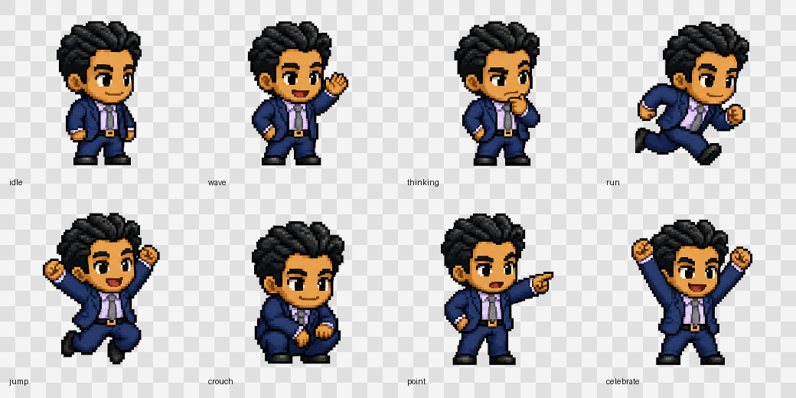

# CodexPet English Guide

This section is written for non-technical users.

CodexPet is a small pixel-style character for Codex. It is based on a business-suit character design and can appear inside Codex as a personal pet.



## What To Send To Someone

If someone only wants to install the pet, they only need these two files:

```text
pet.json
spritesheet.webp
```

In this project, those files are here:

```text
pets/codexpet/pet.json
pets/codexpet/spritesheet.webp
```

They do not need the plugin folder, demo page, source images, or any developer files.

## Reusable Pet Generator Agent

This repo also includes a reusable Codex skill/agent:

```text
skills/codexpet-generator/
```

It captures the method used to make this pet. In future, you can send Codex a character image or sprite sheet and ask:

```text
Use codexpet-generator to turn this character into a Codex pet.
```

If you only have a normal photo of a person, you can also ask:

```text
Use codexpet-generator to generate an 8-bit platformer sprite sheet for this person, then turn it into a Codex pet.
```

The agent is designed to produce:

- an 8-bit platformer sprite sheet from a single photo when needed
- transparent pose PNGs
- `pet.json`
- `spritesheet.webp`
- a preview/contact sheet
- a small install package that only needs the two runtime files

I have also installed it locally at:

```text
~/.codex/skills/codexpet-generator/
```

So on this computer, future Codex sessions can reuse the same workflow directly.

## Simple Installation On Mac

1. Create a new folder called:

```text
codexpet
```

2. Put these two files inside that folder:

```text
pet.json
spritesheet.webp
```

3. Open Finder.

4. Open your home folder. On a Mac, it usually looks like this:

```text
/Users/your-name/
```

5. Find or create this folder:

```text
.codex/pets/
```

If you cannot see `.codex`, press `Command + Shift + .` in Finder to show hidden folders.

6. Put the whole `codexpet` folder inside `.codex/pets/`.

The final result should look exactly like this:

```text
.codex/
  pets/
    codexpet/
      pet.json
      spritesheet.webp
```

7. Restart Codex.

8. If your Codex version supports custom pets, you should be able to choose:

```text
CodexPet
```

## What The Pet Does

Codex chooses different animations depending on what is happening in the app. You do not need to control these manually.

| Situation in Codex | What CodexPet does |
| --- | --- |
| Codex is idle | Stands calmly and waits |
| Codex is working or moving through a task | Runs |
| Codex is greeting or acknowledging something | Waves |
| Codex is thinking or waiting | Looks thoughtful |
| Codex is jumping into action | Jumps |
| Codex needs attention or has a failed state | Uses a lower/crouched pose |
| Codex is pointing something out | Points forward |
| Codex finishes something successfully | Celebrates |

## Visual Examples

| Idle | Wave | Run | Thinking | Celebrate |
| --- | --- | --- | --- | --- |
|  |  |  |  |  |

## Common Mistakes

If the pet does not appear in Codex, check these things:

1. The folder name should be `codexpet`.
2. The folder must be inside `.codex/pets/`.
3. The files must be named exactly `pet.json` and `spritesheet.webp`.
4. There should not be an extra folder inside another folder.

Wrong:

```text
.codex/pets/codexpet/codexpet/pet.json
```

Correct:

```text
.codex/pets/codexpet/pet.json
```

After fixing the files, restart Codex.

---

# CodexPet 中文安装说明

CodexPet 是一个基于像素商务人物生成的 Codex 自定义 pet。这个仓库同时包含：

- Codex 自定义 pet 运行文件
- CodexPet 插件资源包
- 单独 PNG 动作素材
- HTML 预览 demo

## 发送给朋友的文件

如果朋友只是想把这个形象导入 Codex 当 pet，只需要发下面两个文件：

```text
pets/codexpet/pet.json
pets/codexpet/spritesheet.webp
```

这两个文件必须放在同一个文件夹里，文件夹名建议就叫：

```text
codexpet
```

最终朋友电脑上的结构应该是：

```text
~/.codex/pets/codexpet/pet.json
~/.codex/pets/codexpet/spritesheet.webp
```

也就是说：安装 pet 本身不需要 `plugins/`、`.agents/`、`assets/`、`examples/`、`README.md` 或其他文件。

如果你想把完整素材包、插件说明和 demo 一起发给朋友，再发送这个压缩包：

```text
dist/codexpet-plugin.zip
```

这个完整压缩包里包含：

```text
plugins/codexpet/
.agents/plugins/marketplace.json
pets/codexpet/
```

## 可复用 Pet 生成 Agent

这个仓库里也放了一个可复用的 Codex skill/agent：

```text
skills/codexpet-generator/
```

它把这次做 pet 的方法固定成流程。以后你只要给 Codex 一张角色图、头像图或 sprite sheet，然后说：

```text
Use codexpet-generator to turn this character into a Codex pet.
```

如果你只有一张真人照片，也可以说：

```text
Use codexpet-generator to generate an 8-bit platformer sprite sheet for this person, then turn it into a Codex pet.
```

它会按这套流程生成：

- 从单张照片生成 8-bit platformer sprite sheet
- 透明动作 PNG
- `pet.json`
- `spritesheet.webp`
- 预览图/contact sheet
- 只包含两个核心运行文件的小安装包

我也已经把它安装到本机：

```text
~/.codex/skills/codexpet-generator/
```

所以以后你在这台电脑上发素材给 Codex，就可以直接复用这个生成流程。

## 安装方式一：只安装成 Codex Pet

适合只想把 CodexPet 作为 Codex 里的 pet 使用。

1. 新建一个文件夹，命名为：

```text
codexpet
```

2. 把这两个文件放进去：

```text
pet.json
spritesheet.webp
```

如果你收到的是完整压缩包 `codexpet-plugin.zip`，就先解压，然后找到：

```text
pets/codexpet/
```

这个目录里也只有 pet 安装真正需要的两个文件。

3. 打开自己的用户目录。

macOS 通常是：

```text
/Users/你的用户名/
```

4. 找到或创建这个目录：

```text
~/.codex/pets/
```

如果没有 `.codex` 或 `pets` 文件夹，就手动创建。

5. 把 `codexpet` 整个文件夹复制进去。

最终文件结构必须是：

```text
~/.codex/pets/codexpet/pet.json
~/.codex/pets/codexpet/spritesheet.webp
```

不要变成下面这种多套了一层的结构：

```text
~/.codex/pets/codexpet/codexpet/pet.json
```

这是错误的。

6. 重启 Codex。

7. 如果当前 Codex 版本支持自定义 pet，就可以在 pet 选择里看到：

```text
CodexPet
```

### 两个文件安装版示例

朋友安装完后，`codexpet` 文件夹里应该只有这两个核心文件：

```text
codexpet/
  pet.json
  spritesheet.webp
```

## 安装方式二：同时安装插件资源包

适合想让 Codex 也能识别这个素材包、技能说明和 demo 的朋友。

1. 解压 `codexpet-plugin.zip`。

2. 复制插件目录。

从解压目录里找到：

```text
plugins/codexpet/
```

复制到：

```text
~/plugins/codexpet/
```

最终结构：

```text
~/plugins/codexpet/.codex-plugin/plugin.json
~/plugins/codexpet/assets/
~/plugins/codexpet/skills/
~/plugins/codexpet/README.md
```

3. 配置本地插件 marketplace。

打开或创建：

```text
~/.agents/plugins/marketplace.json
```

如果文件不存在，可以写入：

```json
{
  "name": "local-user-plugins",
  "interface": {
    "displayName": "Local User Plugins"
  },
  "plugins": [
    {
      "name": "codexpet",
      "source": {
        "source": "local",
        "path": "./plugins/codexpet"
      },
      "policy": {
        "installation": "AVAILABLE",
        "authentication": "ON_INSTALL"
      },
      "category": "Productivity"
    }
  ]
}
```

如果这个文件已经存在，就只需要把下面这段加入 `plugins` 数组：

```json
{
  "name": "codexpet",
  "source": {
    "source": "local",
    "path": "./plugins/codexpet"
  },
  "policy": {
    "installation": "AVAILABLE",
    "authentication": "ON_INSTALL"
  },
  "category": "Productivity"
}
```

4. 同时安装 pet 文件。

把解压出来的：

```text
pets/codexpet/
```

复制到：

```text
~/.codex/pets/codexpet/
```

5. 重启 Codex。

## 快速检查

安装完成后，检查这两个文件是否存在：

```text
~/.codex/pets/codexpet/pet.json
~/.codex/pets/codexpet/spritesheet.webp
```

`pet.json` 内容应该类似：

```json
{
  "id": "codexpet",
  "displayName": "CodexPet",
  "description": "Your personal pixel companion generated from your suited character.",
  "spritesheetPath": "spritesheet.webp"
}
```

## 常见问题

如果 Codex 里没显示：

1. 确认路径没有多套一层 `codexpet`。
2. 确认已经重启 Codex。
3. 确认当前 Codex 版本支持自定义 pet。
4. 确认文件名是 `pet.json` 和 `spritesheet.webp`。
5. 确认 `pet.json` 里的 `"spritesheetPath": "spritesheet.webp"` 和实际文件名一致。

## 本地预览

项目里也有一个 HTML 预览页：

```text
examples/codexpet-demo.html
```

插件包内的预览页是：

```text
plugins/codexpet/examples/index.html
```

直接用浏览器打开即可查看和切换 CodexPet 的动作状态。
